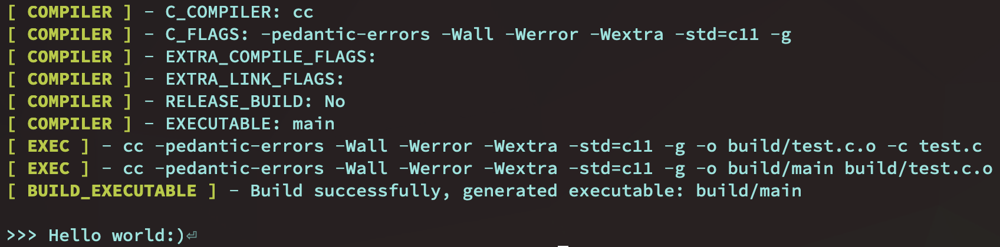
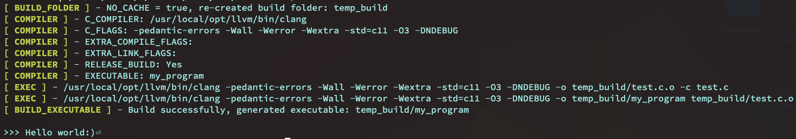
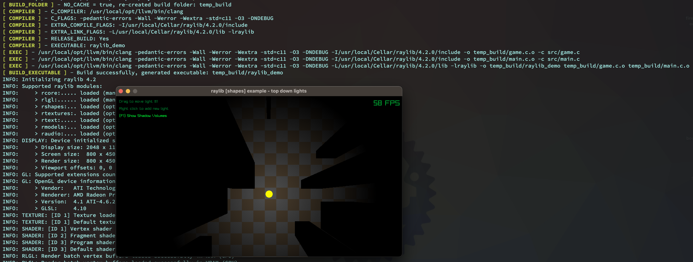

# `cbuild`

### 1. What is it and what it can offer to you

Inspired by [tsoding's nobuild](https://github.com/tsoding/nobuild) and
has been improved.

Easy to understand and use, with no extra configuration syntax (or
language) you need to learn, only C, the one you're super familiar with:)

Here is what `cbuild` can offer to you:

- Only `C` compiler needed for building your C project.

    You don't need to install the extra tools like `make`, `cmake` or anything
    you named it. **Only C compiler needed**.

    If you love C, then just write your own building process by using your
    favorite programming language, it's kind of fun and cool:)

- Improved color logging.

- Support user provided env var to override the default settings.

- Cover different function naming habits.

    So the following function calls are the same, just pick the one you
    preferred:

    - `CBuild_exec_command`
    - `CBuildExecCommand`
    - `CB_exec_command`
    - `CBExecCommand`

    </br>

- Single `cbuild.h` to cover all you need, nothing else.

### 2. Limitation

Only work for `Linux` or `BSD` family at this moment, tested on `Linux/MacOS/FreeBSD`.

</br>

### 3. Usage by examples

#### 3.1 Basic

Source code in `examples/basic`

</br>

- Create `cbuild.c` and include `cbuild.h` and write your own build process

    ```c
    #define C_BUILD_IMPLEMENTATION
    #include "../../cbuild.h"

    int main(int argc, char **argv) {
        CB_setup_build_folder();
        CB_setup_compiler();

        // CB_compile_all("test.c", NULL);
        CB_compile_and_build_executable("test.c", NULL);
    }
    ```

    </br>

- Compile `cbuild.c` and then use it to compile your project:

    ```bash
    cc -o cbuild cbuild.c && ./cbuild && build/main_test
    ```

    

    </br>


#### 3.2 Use configurable env var for the compiled `cbuild` binary

Here are the default env values if you don't provide them:

| Env var | Default value |
| ------- | ------------- |
| C_COMPILER | `cc` |
| RELEASE_BUILD | `false` and `-g` applied<br><br>When `true`, the following settings applied:<br>`-O3 -DNDEBUG`|
| EXECUTABLE | `main` |
| BUILD_FOLDER | `build`, folder will be created if not exists |
| NO_CACHE | `false`<br><br>When `true`, it removes the entire `BUILD_FOLDER` (includes the previous built object files) and run a clean build |

</br>

Also, here is the default `C_FALGS`, feel free to change to what you needed:

```c
#define DEFAULT_C_FLAGS \
    "-pedantic-errors", "-Wall", "-Werror", "-Wextra", "-std=c11", "-g"
#define DEFAULT_C_FLAGS_RELEASE                                                      \
    "-pedantic-errors", "-Wall", "-Werror", "-Wextra", "-std=c11", "-O3", "-DNDEBUG" \

#define DEFAULT_C_FLAGS_SANITIZER                                        \
    "-pedantic-errors", "-Wall", "-Werror", "-Wextra", "-std=c11", "-g", \
        "-fsanitize=address", "-O1", "-fno-omit-frame-pointer"
#define DEFAULT_C_FLAGS_SANITIZER_RELEASE                                 \
    "-pedantic-errors", "-Wall", "-Werror", "-Wextra", "-std=c11", "-O3", \
        "-DNDEBUG", "-fsanitize=address", "-O1", "-fno-omit-frame-pointer"
```

</br>

Source code in `examples/basic`

</br>

- Create `cbuild.c` and include `cbuild.h` and write your own build process

    ```c
    #define C_BUILD_IMPLEMENTATION
    #include "../../cbuild.h"

    int main(int argc, char **argv) {
        CB_setup_build_folder();
        CB_setup_compiler();

        // CB_compile_all("test.c", NULL);
        CB_compile_and_build_executable("test.c", NULL);
    }
    ```

    </br>


- Compile `cbuild.c` and then use it to compile your project and run it:

    ```bash
    #!/bin/sh

    C_COMPILER=$(which clang)
    # C_COMPILER=$(which cc)
    EXECUTABLE="my_program"
    BUILD_FOLDER="temp_build"
    NO_CACHE=true
    RELEASE_BUILD=true

    #
    # Compile `cbuild.c` and then use it to compile the project
    #
    ${C_COMPILER} -o cbuild -g cbuild.c \
        && \
        ENABLE_SANITIZER=true \
        C_COMPILER=${C_COMPILER} \
        BUILD_FOLDER=${BUILD_FOLDER} \
        NO_CACHE=${NO_CACHE} \
        RELEASE_BUILD=${RELEASE_BUILD} \
        EXECUTABLE=${EXECUTABLE} \
        ./cbuild \
        && \
        ${BUILD_FOLDER}/${EXECUTABLE}
    ```

    </br>

    

    </br>

#### 3.3 Use `EXTRA_COMPILE_FLAGS` and  `EXTRA_LINK_FLAGS` macros for complicated projects

You should define `EXTRA_COMPILE_FLAGS` and  `EXTRA_LINK_FLAGS` macros to cover
all the third-parties `C_FLAGS`, just makes sure you define those macros before
`#define C_BUILD_IMPLEMENTATION`. Otherwise, it won't work.

Source code in `examples/raylib-demo`

</br>

- Create `cbuild.c` and include `cbuild.h` and write your own build process

    ```c
    #include <stdio.h>

    #define EXTRA_COMPILE_FLAGS "-I/usr/local/Cellar/raylib/4.2.0/include"
    #define EXTRA_LINK_FLAGS "-L/usr/local/Cellar/raylib/4.2.0/lib", "-lraylib"

    #define C_BUILD_IMPLEMENTATION

    #include "../../cbuild.h"

    int main(int argc, char **argv) {
        CB_setup_build_folder();
        CB_setup_compiler();

        CB_compile_and_build_executable("src/game.c", "src/main.c", NULL);
    }
    ```

    </br>


- Compile `cbuild.c` and then use it to compile your project and run it:

    ```bash
    #!/bin/sh

    C_COMPILER=$(which clang)
    # C_COMPILER=$(which cc)
    EXECUTABLE="raylib_demo"
    BUILD_FOLDER="temp_build"
    NO_CACHE=true
    RELEASE_BUILD=true

    #
    # Compile `cbuild.c` and then use it to compile the project
    #
    ${C_COMPILER} -o cbuild -g cbuild.c \
        && \
        ENABLE_SANITIZER=true \
        C_COMPILER=${C_COMPILER} \
        BUILD_FOLDER=${BUILD_FOLDER} \
        NO_CACHE=${NO_CACHE} \
        RELEASE_BUILD=${RELEASE_BUILD} \
        EXECUTABLE=${EXECUTABLE} \
        ./cbuild \
        && \
        ${BUILD_FOLDER}/${EXECUTABLE}
    ```

    </br>

    

    </br>


